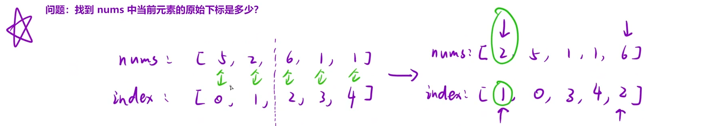

给你一个整数数组 `nums`，按要求返回一个新数组 `counts`。数组 `counts` 有该性质： `counts[i]` 的值是 `nums[i]` 右侧小于 `nums[i]` 的元素的数量。

这里需要用到元素的初始下标，考虑到数组中可能存在重复元素，所以用数组代替哈希表



`nums`和`index`绑定变换

```C++
class Solution {
    vector<int> index;//记录下标
    vector<int> ret;//存放结果
    int tmpNums[1000000];
    int tmpIndex[1000000];    
public:
    vector<int> countSmaller(vector<int>& nums) 
    {
        int n = nums.size();
        ret.resize(n);
        index.resize(n);
        //初始化index
        for(int i = 0;i<n;i++)
        index[i] = i;
        mergesort(nums,0,n-1);
        return ret;
    }
    void mergesort(vector<int>& nums,int left,int right)
    {
        if(left >= right)
        return;
        //1.确定中间值
        int mid = left + (right - left) /2;
        //2.递归分解原数组
        mergesort(nums,left,mid);
        mergesort(nums,mid+1,right);
        //3.合并有序数组同时统计个数
        int cur1 = left,cur2 = mid + 1,i = 0;
        while(cur1 <= mid && cur2 <=right)
        {
            if(nums[cur1] <= nums[cur2])
            {
                tmpNums[i] = nums[cur2];
                tmpIndex[i++] = index[cur2++];
            }
            else
            {
                ret[index[cur1]] += right - cur2 + 1;
                tmpNums[i] = nums[cur1];
                tmpIndex[i++] = index[cur1++];
            }
        }
        //处理一下未完成的排序
        while(cur1 <= mid) 
        {
            tmpNums[i] = nums[cur1];
            tmpIndex[i++] = index[cur1++];
        }
        while(cur2 <= right)
        {
            tmpNums[i] = nums[cur2];
            tmpIndex[i++] = index[cur2++];
        }
        //4.还原数组
        for(int j = left;j<=right;j++)
        {
            nums[j] = tmpNums[j-left];
            index[j] = tmpIndex[j-left];
        }
    }
};

```

### 以 `[5, 2, 6, 1]` 为例

原数组第一次分割：

```C++
左半: [5, 2]    右半: [6, 1]
```

- 左半内部的逆序对（5 和 2），在 `[5, 2]` 这一层的递归里统计。[左左]

- 右半内部的逆序对（6 和 1），在 `[6, 1]` 这一层的递归里统计。[右右]

- 左半和右半之间的逆序对（5/2 和 6/1 之间的跨区间对），在最后一层合并 `[2, 5]` 和 `[1, 6]` 时统计。[左+右]

依旧坚持总逆序对数 = 左左+右右+左右
