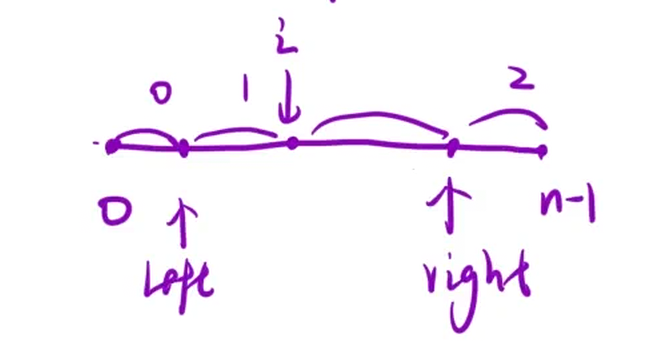
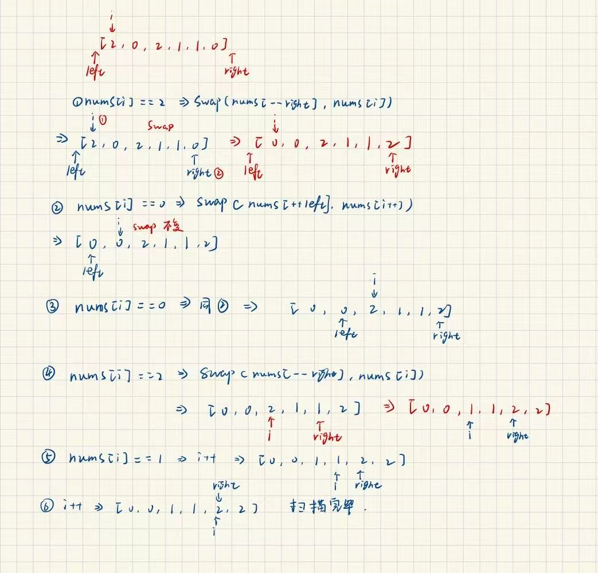

给定一个包含红色、白色和蓝色、共 `n` 个元素的数组 `nums`，[原地](https://baike.baidu.com/item/%E5%8E%9F%E5%9C%B0%E7%AE%97%E6%B3%95) 对它们进行排序，使得相同颜色的元素相邻，并按照红色、白色、蓝色顺序排列。

我们使用整数 `0`、 `1` 和 `2` 分别表示红色、白色和蓝色。

必须在不使用库内置的 sort 函数的情况下解决这个问题。

示例 1：

```C++
输入：nums = [2,0,2,1,1,0]
输出：[0,0,1,1,2,2]
```

思路：

用三指针 `left`、`right`、`i` 维护区间：

- `[0, left]` 全为 0

- `[left+1, i-1]` 全为 1

- `[i, right-1]` 待扫描

- `[right, n-1]` 全为 2





当`nums[i] == 0`时 → `nums[++left] == nums[i++]`

当`nums[i] == 1`时 → `i++`

当`nums[i] == 2`时→ `nums[--right] == nums[i]`这里`i`不能++，因为交换后此时`i`仍处于待扫描区域，只有当i ≥ right的时候才算扫描完

通过让left和right初始都在数组外结合++left与--right实现扩展范围，因为一开始++或者--本质都只是为了让指针进入数组开始归纳范围。

以示例1为例`[2,0,2,1,1,0]`,`left = -1,right = nums.size(),i = 0`

1.初始`nums[i] == 2`,执行`swap(nums[--right],nums[i])`，此时`right`先`--`指向`0`的位置，再与`i`交换，数组变为`[0,0,2,1,1,2]`

2.此时`nums[i] == 0`,执行`swap(nums[++left],nums[i++])`,`left`先指向`0`，再与`i`交换，也就是自身与自身交换。在执行`i++`

3.此时`i`指向`0`，依旧执行`swap(nums[++left],nums[i++])`，依旧自身与自身交换再i++

4.此时`i`指向`2`，执行`swap(nums[--right],nums[i])`，`right`先`--`，指向`1`与`nums[i] == 2`交换

5.此时i指向1→i++

6.i++，随后right == i终止扫描返回数组

```C++
class Solution {
public:
    void sortColors(vector<int>& nums) 
    {
       int left = -1,right = nums.size(),i = 0;
       while(i < right)
       {
        if(nums[i] == 0)
        swap(nums[++left],nums[i++]);
        else if(nums[i] == 2)
        swap(nums[--right],nums[i]);
        else
        i++;
       }  
    }
};
```
