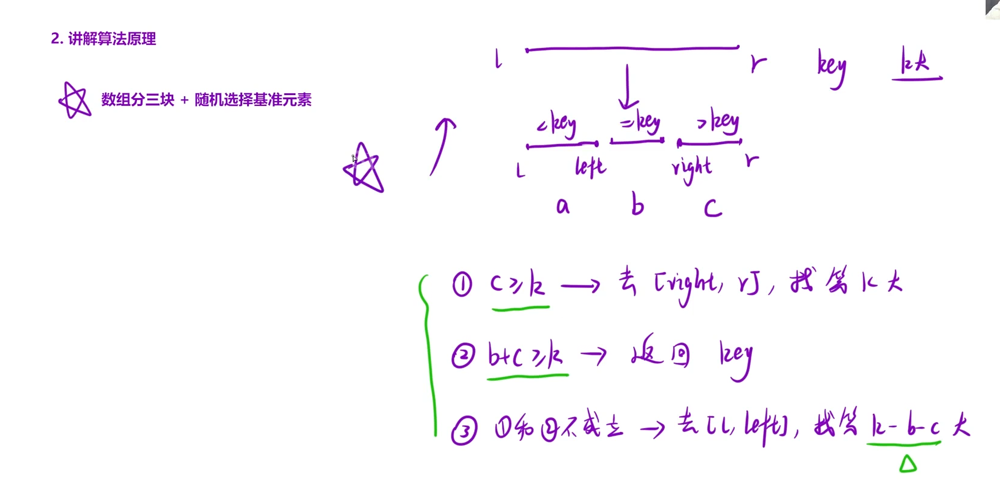

给定整数数组 `nums` 和整数 `k`，请返回数组中第 `k` 个最大的元素。

请注意，你需要找的是数组排序后的第 `k` 个最大的元素，而不是第 `k` 个不同的元素。

**示例 1：**

```C++
输入：nums = [3,2,1,5,6,4], k = 2
输出：5
```

**示例 2：**

```C++
输入：nums = [3,2,3,1,2,4,5,5,6], k = 4
输出：4
```



思路：随机选择一个基准元素key将数组分为三块，分别是`<key,=key,>key`,定义三个区间分别有a，b，c个元素，定义三个区间的边界为`left`与`right`，数组的端点为`l和r`，`=key`区间为`[left+1,right-1]`,分类讨论第k个最大元素在某个区间

1.在`>key`区间

此时`c≥k`→在`[right,r]`找

2.在`=key`区间

此时`b+c≥k`,直接返回`key`

3.在`<key`区间

此时`1和2不成立`→在`[l,left]`找

```C++
class Solution {
public:
    int findKthLargest(vector<int>& nums, int k) 
    {
        return qsort(nums,0,nums.size()-1,k);
    }
    int qsort(vector<int>& nums,int l,int r,int k)
    {
        if(l == r)
        return nums[l];
        //1.选择基准元素
        int mid = getmid(nums,l,r);
        int pivot = nums[mid];
        //2.根据基准元素将数组划分为三块
        int left = l - 1,right = r + 1,i = l;
        while(i < right)
        {
        if(nums[i] < pivot)//在基准元素左边
        swap(nums[++left],nums[i++]);
        else if(nums[i] == pivot)//等于基准元素时该元素无需移动，继续遍历下一个
        i++;
        else
        swap(nums[--right],nums[i]);
        }
        //3.分类讨论
        int c = r - right + 1,b = right - left - 1;
        if(c >= k)
        return qsort(nums,right,r,k);
        else if(b+c >= k)
        return pivot;
        else
        return qsort(nums,l,left,k-b-c);
    }
    int getmid(vector<int>& nums, int left, int right) 
    {
    int mid = left + (right - left) / 2;
    // 直接返回中位数的下标，不交换元素
    if ((nums[left] <= nums[mid] && nums[mid] <= nums[right]) ||(nums[right] <= nums[mid] && nums[mid] <= nums[left])) 
    return mid;
    else if ((nums[mid] <= nums[left] && nums[left] <= nums[right]) || 
    (nums[right] <= nums[left] && nums[left] <= nums[mid])) 
    return left;
    else 
    return right;
    }
};  
```

注意：这里取基准值的时候不能进行"交换"，否则分好的区块会被摧毁。getmid只能是取中位数操作不能进行"排序"
