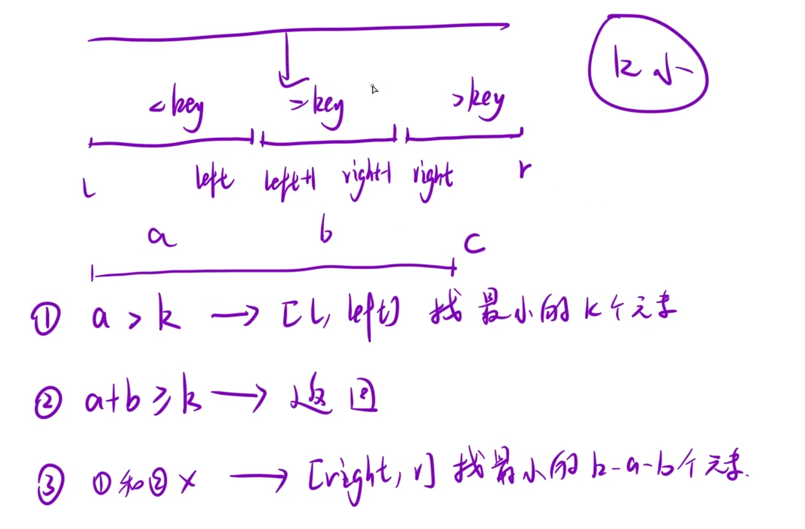

设计一个算法，找出数组中最小的k个数。以任意顺序返回这k个数均可。

**示例：**

```C++
输入： arr = [1,3,5,7,2,4,6,8], k = 4
输出： [1,2,3,4]
```

思路：依旧分三段，每一段元素个数分别为a b c ,比较k和a b c的大小关系，分类讨论



无需对每段进行**精细**排序

```C++
class Solution {
public:
    vector<int> smallestK(vector<int>& arr, int k) 
    {
        if(k == 0)
        return {};
        qsort(arr,0,arr.size()-1,k);
        return vector<int>(arr.begin(),arr.begin()+k);    
    }
    void qsort(vector<int>& arr,int l,int r,int k)
    {
        //1.确定基准元素
        int mid = getmid(arr,l,r);
        //2.将数组分为三块
        int left = l-1,right = r+1,i = l;
        int pivot = arr[mid];
        while(i < right)
        {
            if(arr[i] < pivot)
            swap(arr[++left],arr[i++]);
            else if(arr[i] == pivot)
            i++;
            else
            swap(arr[--right],arr[i]);
        }
        //3.分三种情况讨论
        int a = left - l + 1,b = right -left - 1;
        if(a >= k)
        qsort(arr,l,left,k);
        else if(a+b >= k)
        return;
        else
        qsort(arr,right,r,k-a-b);
    }
    int getmid(vector<int>& arr,int left,int right)
    {
         int mid = left + (right - left) / 2;
        if ((arr[left] >= arr[mid] && arr[mid] >= arr[right]) ||
            (arr[right] >= arr[mid] && arr[mid] >= arr[left])) 
        return mid;
        else if ((arr[mid] >= arr[left] && arr[left] >= arr[right]) ||
                   (arr[right] >= arr[left] && arr[left] >= arr[mid])) 
        return left;
        else 
        return right;
    }
    
};
```

**补充：为什么 `else if(a+b >= k)` 时直接 `return`，而不写成 `qsort(arr, l, right-1, k)`？**

走到这个分支时，说明 `a < k ≤ a+b`：

- 小于 `pivot` 的元素有 `a` 个，它们都必然属于最小的 k 个数（因为 `a < k`，光靠它们还不够）；
- 等于 `pivot` 的元素有 `b` 个，而 `k-a` 个恰好能从它们里补齐（因为 `a+b ≥ k`）。

所以此时**数组前 k 个位置 `[l, l+k-1]` 已经装好了我们要的最小的 k 个数**——前 `a` 个是 `< pivot` 的，后面补上若干 `== pivot` 的。递归的目的（把最小的 k 个数挪到数组最前）已经达成，直接 `return` 结束即可。

如果改成 `qsort(arr, l, right-1, k)` 再排一次：区间 `[l, right-1]` 里全是 `≤ pivot` 的元素、且最小的 k 个已经在最前，重新分区**纯属多余**——结果不会变，只是白白浪费一轮分区；如果基准选得不好，还可能退化成一层层无意义的递归，徒增开销甚至有栈溢出风险。
